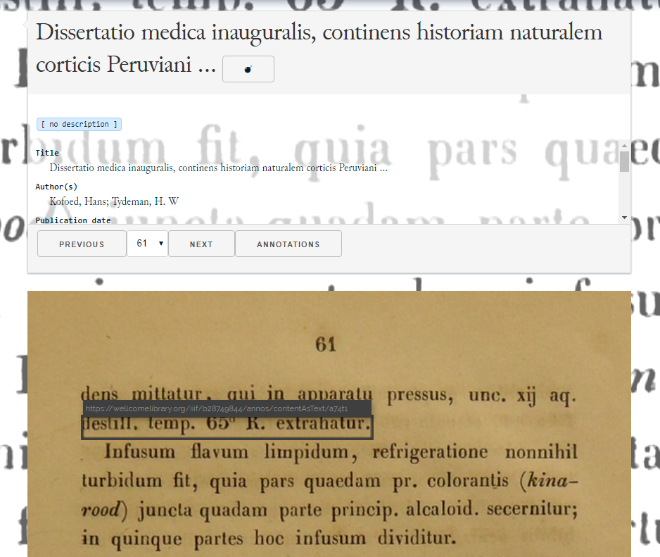

# Rerum Manifest Transcription Reader
This component is designed to allow for simple implementation of the Rerum tool for viewing transcription annotations and metadata.

## Installation
The `component` directory contains all the elements required for this component. No package has been set up yet for this, but you can link or copy the `rr-reader.js` file for your own application.

## Elements

* **`rr-reader-header`** Contains the header information, including the title, description, and available metadata as well as paging and options. [TODO: options for viewing, default languages, etc.]
* **`rr-reader-description`** Presents the `IIIF:Manifest`'s value for `description`, expecting a string (possibly HTML) or an array of strings (language choice). When an array is detected, switches for each language become available. The current default language is set to `en`.
* **`rr-reader-metadata`** Renders each key-value pair in the `metadata` property within a `<dl>`. Expects simple text or HTML for each label.
* **`rr-reader-paging`** Presents a `<select>` of each `sc:Canvas`.`label` in the primary `sc:Sequence` for selecting a specific page for viewing. Shows "Previous" and "Next" buttons when available.
* **`rr-reader-image`** Displays the full image annotated onto the `sc:Canvas` with mouseover events on the page annotations, showing the selector and the `@id` of the active annotation.
* **`rr-reader-transcription`** Shows only the transcription annotations as simple text values with mouseover events that activate the annotation.
* **`rr-reader-annotations`** Shows the cropped images for each annotation in order. The `shades` option hides the text content behind the images. Mouseover event activates the annotation.
* **`rr-reader-backsplash`** Places a full-width, altered (CSS `filter`) image of the current active canvas behind the interface with the active annotation shown at the top of the screen.

## Events (pending)

**rr-active-collection** Announces the selection of a new active collection in the interface. The payload is either the `@id` of this target or the complete object.

**rr-active-manifest** Announces the selection of a new active manifest in the interface. The payload is either the `@id` of this target or the complete object.

**rr-active-canvas** Announces the selection of a new active canvas in the interface. The payload is either the `@id`ffo this target or the complete object.

**rr-active-annotation** Announces the selection of a new active annotation in the interface. The payload is either the `@id` of this target or the complete object.
